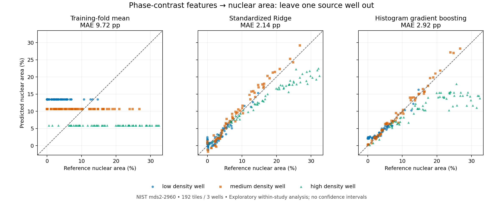

# NIST iPSC nuclear-area benchmark

**192 phase-contrast tiles from three source wells, with each whole well held out in turn.**
The outcome is fluorescence-derived nuclear mask area. This is an exploratory imaging measurement benchmark.

## Primary results

Errors are **percentage points of tile area**, not relative percentage errors.

| Fixed model | MAE (pp) | RMSE (pp) | R² |
|---|---:|---:|---:|
| Training-fold mean | 9.72 | 11.43 | -0.597 |
| Standardized Ridge | 2.14 | 3.30 | 0.867 |
| Histogram gradient boosting | 2.92 | 5.28 | 0.659 |

Pooled and equal-well MAE agree because each well contributes 64 tiles.
These are all three prespecified baselines; no hyperparameter search was performed.

Each dot is a tile predicted by a model that did not train on its source well.
The dashed line is equality. Tiles within a well are related measurements.

## Errors by held-out well

| Source well | Mean baseline MAE (pp) | Ridge MAE (pp) | Boosting MAE (pp) |
|---|---:|---:|---:|
| training_low | 10.42 | 0.93 | 1.07 |
| training_medium | 6.03 | 1.33 | 0.63 |
| training_high | 12.72 | 4.17 | 7.08 |

The high-density well is the hardest holdout for both learned models. Density and
well identity cannot be separated in this design. Strong pooled performance does
not establish robustness across laboratories, donors, acquisition days or density extremes.

## Background diagnostic

| Source well | Tiles | Empty nuclear masks | Mean nuclear area (%) | Observed range (%) |
|---|---:|---:|---:|---|
| training_low | 64 | 4 | 3.07 | 0.00–14.71 |
| training_medium | 64 | 2 | 8.68 | 0.00–26.76 |
| training_high | 64 | 0 | 18.22 | 0.59–32.48 |

The prespecified secondary subset contains 186 tiles with nonzero nuclear area.
Models were fitted on all training tiles; this diagnostic does not change the primary analysis.

| Model | Nonempty-tile MAE (pp) | Predictions outside [0, 1] |
|---|---:|---:|
| Training-fold mean | 9.63 | 0 |
| Standardized Ridge | 2.17 | 12 |
| Histogram gradient boosting | 2.97 | 0 |

Predictions are not clipped, including negative predictions. Low area error is not
an instance-segmentation score or a cell-count error.

## What this supports

The existing nine phase-image descriptors carry information about the provided nuclear-area
reference within this study. The per-well failures and saved predictions are the starting point
for a collaborator review. No senescence, differentiation, pluripotency, viability or clinical
claim follows from this measurement. Reference masks were generated automatically from fluorescence.

There are only **three source groups**. No confidence interval, significance test or external
validation claim is provided. Further tuning on these folds would make them development data
for that tuning; an independent dataset is needed for a subsequent generalization claim.

## Reproducibility

Feature table SHA-256: `e055bf31bc6d08594b9010625a779d027821c2333cb369e7247c011c81158645`.

- [Analysis plan](../ANALYSIS_PLAN.md), fixed before fitting these models.
- [Data card and rerun commands](../README.md).
- [Source archive and tile provenance](../data/provenance.json).
- [Exact configuration, versions and fold metrics](metrics.json).
- [Every out-of-fold prediction](predictions.csv) and [secondary diagnostics](diagnostics.json).

Data: [NIST mds2-2960](https://doi.org/10.18434/mds2-2960), accompanying
[Asmar et al. (2024)](https://doi.org/10.1371/journal.pone.0298446).
Derived analysis dated 2026-09-24; [attribution and source terms](../SOURCE_NOTICE.md).
NIST did not produce or endorse these benchmark results.
